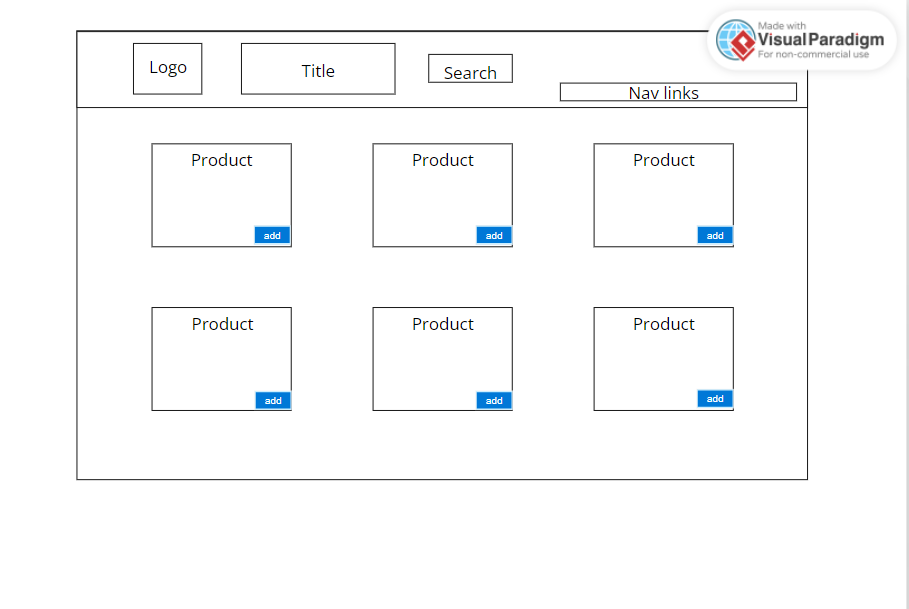
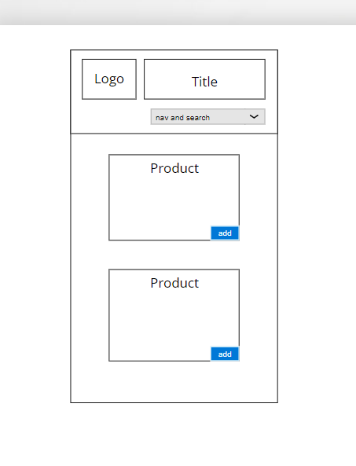

# Legends Gym

Legends gym is a real gym I am a member of based in Dublin. I recieved full permission from the owner before basing this on our gym. It is a full stack application using django, HTML, CSS, JavaScript and Bootstrap.\

The site is liked together using ElephantSQL for the database, Amazon Web Services for hosting the images and static files and Stripe for taking card payments. All of this is joined together and deployed on Heroku.\
<a href="https://legends-gym-b229ec203712.herokuapp.com/"> Link to the deployed site</a>

## Intent

The **Legends Gym Website** is designed with a clear intent: to encourage individuals in their fitness journeys and provide a relevant shopping experience for fitness enthusiasts. The site aims to:

- **Promote Fitness:** Inspire and support people in achieving their fitness goals by offering top-notch training services and premium fitness content.

- **Access to Quality Gear:** Provide access to high-quality martial arts training equipment and fitness gear including own brand gear.

- **Community Building:** Create a vibrant fitness community by connecting like-minded individuals, trainers, and enthusiasts.

- **Convenience:** Offer an user friendly e-commerce platform for purchasing fitness products and registering for training programs.

## Site features

- As an e-commerce site, users are able to search through the contents as well as sort their searches.\
- Filtering by category is also available from the main nav bar\
- Users can click into the full products to see details and add them to their cart.\
- In the shopping cart page users can update or remove items before moving onto the checkout page.\
- In the main checkout page users must be logged in to complete their orders\
- In this page there is a order details form and card payment using Stripe\
- After a successful checkout a success page is rendered for the users as well as a message using django messages.\
- Successful orders can be viewed in the admin panel.\
- Users can also log in and sihn up from the header at any area of the site\
- Newsletter sign up using Mailchimp form also provided in the footer.\

### Features not implemented

- As of writing my main image did not transfer from the dev environment to deployment. Debugging is needed
- A profile app and nessessary models were created but an individual profile page i ra out of time to impliment these
- Webhooks is another area that could be improved here but a lot more time would be needed to get a grip on them.
- More testing both manual and code should also be implemnted

## Testing

- Site was greatly tested on dev environment but more testing of models and forms on the deployed site would have been better.
- testing found many bugs with models and views and all that were found were dealt with(most were typos, I will never name my .env file env.py again anyway!)

## Deployment

- Create new Heroku app
- link up AWS, ElephantSql
- Add config vars
- Link Heroku app to Github repo
- Click deploy

Visual Design Decisions

## Visual Design Decisions
This section provides insights into the visual design choices and includes wireframes for both desktop and mobile views.

### Desktop Wireframe

#### Header
- **Logo:** Positioned at the top-left corner, our logo represents the brand's identity and sets the tone for the website.
- **Navigation:** The top navigation bar is clean and user-friendly, ensuring easy access to key sections.
- **Search Bar:** A prominent search bar encourages users to find products quickly.
- **User Account:** User account-related links are conveniently located on the top-right corner.

#### Hero Section
- **Engaging Image:** A high-quality image showcasing our gym welcomes users to the site.
- **Call to Action:** Clear and enticing call-to-action buttons direct users to explore our products and training plans.

#### Product Showcase
- **Featured Products:** Eye-catching product cards display featured items with images, descriptions, and prices.
- **Categories:** A categorized layout makes it easy for users to find products of interest.

#### Footer
- **Newsletter Signup:** The footer features a newsletter signup form, encouraging users to stay informed.

### Mobile Wireframe

#### Mobile Navigation
- **Hamburger Menu:** To optimize space, a hamburger menu provides access to the navigation items.

#### Hero Section
- **Simplified Hero:** On mobile, the hero section is simplified to maintain a clean and uncluttered appearance.

#### Product Showcase
- **Product Cards:** Mobile-friendly product cards stack neatly for easy scrolling.

### Color Scheme and Typography
The color scheme consists of a combination of light grey and white for readability with overlays over the background to ensure no text is lost. Buttons are coloured gray for navigation, blue for adding items and red for removing items to keep consistant colour scheme throughout. Helvetica is used as the primary font for readability.

### Responsiveness
Legends Gym is designed to be fully responsive, ensuring a seamless experience across various devices and screen sizes.

### Conclusion
The visual design decisions are driven by the goal of providing an engaging, user-friendly experience for visitors. The site strives to be visually appealing, accessible, and easy to navigate, whether you're using it on a desktop computer or a mobile device.

## Agile Development

### Introduction
Agile methodologies allow us to adapt to changing requirements, collaborate effectively, and maintain a high level of transparency throughout the development process. In the case of Legends Gym, sprint planning was planned out on a Google doc, each sprint was designed to piece relevant tasks together. Each sprint was broken into tasks for use on a Kanban board. As all issues were considered nessessary for the project, no prioritisation system was used, some sprints were just allowed to take longer than others.

### Sprint Planning
The Agile process began with sprint planning, where we outlined the goals and tasks for each development cycle. To view the planned out sprint document, please refer to [Sprint Planning Document](https://docs.google.com/document/d/1lW8b0zDkVcQvfnU1yQR4iXPW2X9ntdGj0Hxc6MxuHH4/edit?usp=sharing).

### Kanban Board
A Kanban board was used to visualize and manage our tasks and progress. You can track the ongoing and completed tasks on the [Kanban Board](https://github.com/users/DerekMor/projects/3/views/1). This board provides real-time information into the development status.

## SEO

1. Relevant and Quality Content:
THe site tries to provide the relevent content to what people would come looking for and its name suggests

2. Keyword Optimization:
Keyword optimization is present, certainly in product names, though descpitions could have been longer with more keywords. All the headings are also in order

3. Meta Tags and Descriptions:
Meta tag with a large description provided in the head  

4. Mobile Responsiveness:
The website's responsive design ensures that it displays optimally across various devices, including smartphones and tablets. Search engines prioritize mobile-friendly websites. 

5. Sitemap and Robots.txt:
The website features a well-structured sitemap and robots.txt file, providing clear instructions to search engine crawlers regarding which pages to index and which to exclude. This ensures that search engines discover and index the most relevant and valuable pages.

## Digital Marketing
I had an issue here as the day of writing before the deadline my account was suspended and i know the course said to take screenshots but if i have to redo it i will.
\
I will link the real gyms facebook page I am unsure about whether my account was flagged because I am part of this and was building one with a similar name and images but <a href="https://www.facebook.com/p/D%C3%BAn-Laoghaire-Martial-Arts-100057563164646/"> here</a> it is.\
My own version wasnt huge but I was focusing on organic growth using humour and replying to comments to try to build a relationship with followers then possibly using posts that work for paid ads in the long run.\
The targeted user was anybody into fitness or looking to join martial arts.\
These users would mostly use facebook or instagram.\
Posts would help people who need inspiration to get started by offers or exclusive gear.\
They would recieve these offers by email or social media.\
The newsletter was also a part of the strategy as users had chosen to be on it.

## Business Model

**Legends Gym** operates as a B2C (Business to Consumer) company with a primary focus on fitness and e-commerce. Revenue streams include:

- **E-commerce Sales:** Selling martial arts training equipment, fitness gear, and related products through an online store.

- **Gym Memberships:** Offering memberships for access to physical gym facilities.

- **Training Services:** Providing training classes and programs.

- **Merchandise and Equipment:** Selling branded merchandise and fitness essentials.

- **Membership Tiers:** Offering different membership levels to cater to various customer needs.

Legends Gym's goal is to provide a comprehensive fitness experience to customers while maintaining a profitable business model.

## Credits
- Bootstraps docs
- Stripes docs
- CodeInstitutes Boutique-Ado (particulary the stripe payments)
