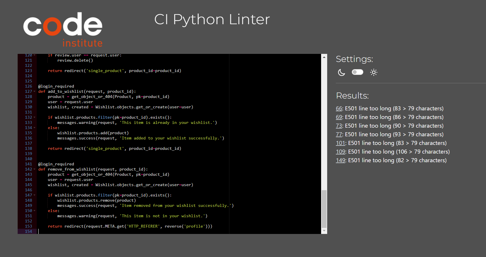
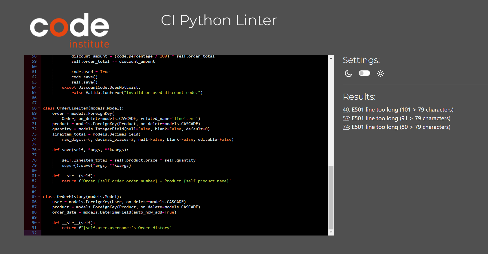

# Testing Documentation

## Manual Testing
Manual tests have been performed and documented to ensure the usability and proper function of the website. This testing involved trying multiple options on each page to try to find if any of the website functions were not working as expected. These were all documented in Github annd the list can be found <a href="https://github.com/DerekMor/legends_gym/issues?q=+label%3ATest+"> HERE </a>.   An example of manual testing of one of the pages on the site can seen below.

## Html Validation
### Home page

### One time code page

### Profile page

### All Products page

### Single Product page

### Add Review page

### Logout page

### Registration page

### Login page

### Cart page

### Checkout page
Here things get a little strange. My forms work spread across two divs like they are supposed to. The form will not submit if neither form is filled out and the payment section is side by side with the details form which is more visually appealing on larger screens. If I was to change the tags to fix these errors the form will work but the payment section will be in the same column as the details which is fine on mobile or the two forms will be independent and one can submit without the other being filled out. Because of this I am leaving it the way it is as the page is working the way it is supposed to over all screen sizes and page layouts.

### Checkout Success page

## CSS Validation
### base.css

### checkout.css

## Python Validation
In all cases I could not solve the line too long issue from getting an error using an indent or a \ for an explicit continuation. It told me the new line was under indented until it got so far that it was over indented so the line too long were left in. The only way I could make the error dissapear on the validation was by indenting the continuation by a tab and then a space which broke my code so i chose working code over removing line too long errors.

### profiles/views.py

### profiles/urls.py

### profiles/signals.py

### profiles/models.py

### products/views.py

### products/urls.py

### products/models.py

### legends_gym/urls.py

### home/views.py

### home/urls.py

### checkout/views.py

### checkout/urls.py

### checkout/models.py

### checkout/admin.py

### cart/views.py

### cart/urls.py

### cart/contexts.py

